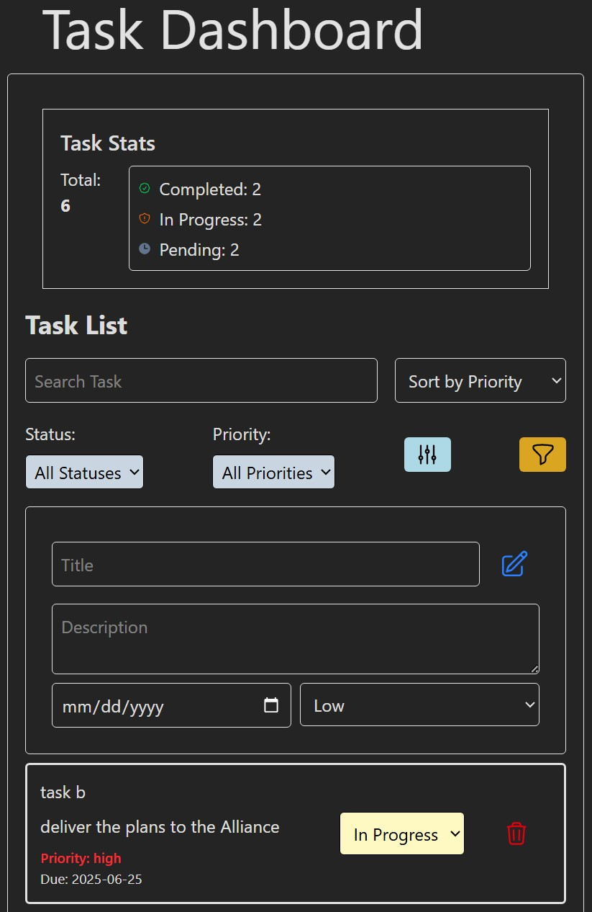
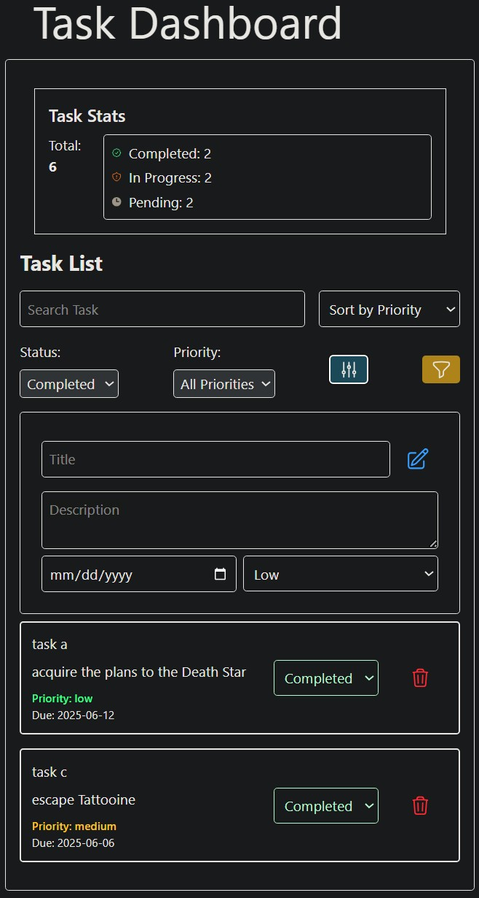

# React Dashboard Application

This is a solution to the [Module 9 SBA: Taskk Management Dashboard](https://ps-lms.vercel.app/curriculum/se/415/sba). 

## Table of contents

- [Overview](#overview)
  - [The challenge](#the-challenge)
  - [Screenshot](#screenshot)
  - [Links](#links)
- [My process](#my-process)
  - [Built with](#built-with)
  - [What I learned](#what-i-learned)
  - [Continued development](#continued-development)
  - [Useful resources](#useful-resources)
- [Acknowledgments](#acknowledgments)

## Overview

In this assessment, you will apply the skills you have developed throughout your React training to build a functional, real-world dashboard application. This project will test your understanding of React components, state management, TypeScript integration, form handling, and component composition.

You will create a **Task Management Dashboard** using React and TypeScript. The final deliverable will include a GitHub repository with your project and a written reflection on your approach and the challenges you faced.

### The challenge

Project Planning
- [ ] Review requirements and define implementation strategy
- [ ] Outline components, state management, and TypeScript interfaces
- [ ] Plan form validation, state updates, and component communication

Component Planning
- [ ] Design component hierarchy and communication flow
- [ ] Plan filtering and sorting functionality


### Screenshot





### Links

- Solution URL: [GitHub: task-manager](https://github.com/DblRH600/task-manager)
- Live Site URL: []()

## My process

### Built with

- React
- Vite
- Tailwinds
- CSS custom properties
- Flexbox
- CSS Grid
- Mobile-first workflow

### What I learned

This SBA tested and demonstrated the process of **rendering lists**, working with **useState** (State Management Properties) and **component connections**.

Code Snippet:

```jsx TaskList
function TaskList() {
  //   State variables for dynamic functions
  const [tasksState, setTasksState] = useState(getInitialTasks());
  console.log("Initial task state:", tasksState);
  const [filters, setFilters] = useState({
    status: "all-statuses",
    priority: "all-priorities",
  });
  const [searchTerm, setSearchTerm] = useState("");
  const [sortField, setSortField] = useState("priority");

  // used to interact with local storage
  const updateStorage = (updatedTasks) => {
    localStorage.setItem("tasks", JSON.stringify(updatedTasks));
  };

  //   Used for handling Add task function
  //   This function is called from the TaskForm component
  const handleAddTask = (newTask) => {
    const updatedTasks = [...tasksState, { ...newTask, id: Date.now() }];
    setTasksState(updatedTasks);
    updateStorage(updatedTasks);
  };

  //   Used for handling Delete task function
  const handleDelete = (taskId) => {
    const updatedTasks = tasksState.filter((task) => task.id !== taskId);
    setTasksState(updatedTasks);
    updateStorage(updatedTasks);
  };

  //   Used to handle Task Status function
  const handleStatusChange = (taskId, newStatus) => {
    const updatedTasks = tasksState.map((task) => {
      if (task.id === taskId) {
        return { ...task, status: newStatus };
      }

      return task;
    });

    setTasksState(updatedTasks);
    updateStorage(updatedTasks); // Update local storage after status change
  };

  //  Used to handle Filtering task
  const handleFilterChange = (newFilters) => {
    setFilters((prev) => ({ ...prev, ...newFilters }));
  };

  const filteredTasks = tasksState
    .filter((task) => {
      const status = filters.status || "all-statuses";
      const priority = filters.priority || "all-priorities";
      const matchesStatus = status === "all-statuses" || task.status === status;
      const matchesPriority =
        priority === "all-priorities" || task.priority === priority;
      const matchesSearchTerm = task.title
        .toLowerCase()
        .includes(searchTerm.toLowerCase());
      return matchesStatus && matchesPriority && matchesSearchTerm;
    })
    .sort((a, b) => {
      if (sortField === "priority") {
        return a.priority.localeCompare(b.priority);
      } else if (sortField === "dueDate") {
        return new Date(a.dueDate) - new Date(b.dueDate);
      } else if (sortField === "status") {
        return a.status.localeCompare(b.status);
      }
      return 0;
    });

  console.log("Filtered Tasks:", filteredTasks);

  return (
    <div className="task-list m-4 p-4 border rounded">
      <TaskStats tasks={tasksState} />

      <h2 className="text-2xl font-bold mb-4">Task List</h2>

      <div className="flex gap-4 mb-4 items-justify-between">
        <input
          className="border p-2 rounded w-full"
          type="text"
          placeholder="Search Task"
          value={searchTerm}
          onChange={(e) => setSearchTerm(e.target.value)}
        />

        <select
          onChange={(e) => setSortField(e.target.value)}
          className="border p-2 rounded"
        >
          <option value="priority">Sort by Priority</option>
          <option value="dueDate">Sort by Due Date</option>
          <option value="status">Sort by Status</option>
        </select>
      </div>

      <TaskFilter onFilterChange={handleFilterChange} />
      <TaskForm onAddTask={handleAddTask} />
      <ul>
        {filteredTasks.map((task) => (
          <TaskItem
            key={task.id}
            task={task}
            onDelete={handleDelete}
            onStatusChange={handleStatusChange}
          />
        ))}
      </ul>
    </div>
  );
}

export default TaskList;
```

### Continued development

I need to gain a better understanding on where the **useState** hook should be placed and when to utilize ***props*** when passing functionality between parent and component connections. 

### Useful resources

- [Documentation: React: useState](https://react.dev/reference/react/useState) - ***React.dev*** provides useful documentation and examples for how to use **useState** hooks.

- [Documentation: tailwindcss](https://tailwindcss.com/docs/installation/using-vite) - ***tailwindscss*** was useful in helping to style the project.

## Acknowledgments

I want express aprpeciation to Abraham Tavarez and Colton Wright for their help with understading how **useState** should be implemented in order for its use for each **component** impacted. 
